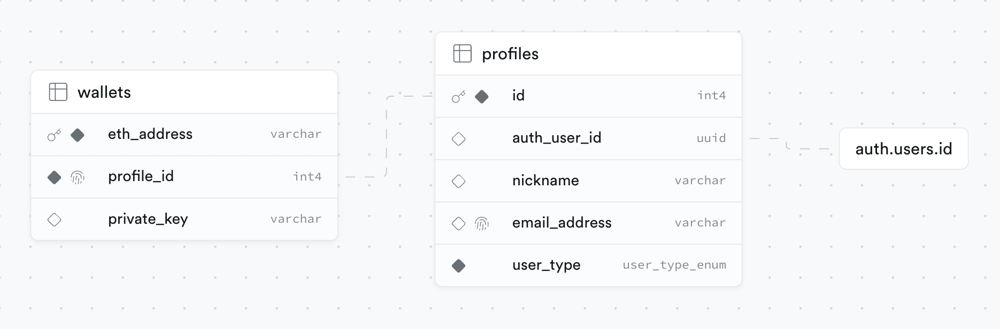

# OPENFORMAT Get Started Template!

### Prerequisites

- We're using Bun as the JavaScript runtime for its awesome performance - [Bun](https://bun.sh/)

### Getting Started

1. Clone the repository:
```bash
git clone https://github.com/open-format/get-started.git
```

2. Navigate to the project directory:
```bash
cd get-started
```

3. Install dependencies:
```bash
bun install
```

4. Execute development commands:
```bash
bun dev
```

5. Open your browser to view the applications:
   - Backend is running at [http://localhost:8000](http://localhost:8000)
   - React app is available at [http://localhost:3000](http://localhost:3000)

### Database

For the databse we advise using [Supabase](https://supabase.com) and setting up a Postgres database there. With Supabase we also manage authentication and the option to sign up with email address and a magic link.

The database schema contains a `profiles` table where user profile data such as nickname and email address is stored. The `profiles`.`auth_user_id` column references the internal Supabase `users` table where authentication data is stored. There is also a `wallets` table for storing users' Web3 wallet addresses as well as a wallet private key which is required for the magic link signup methos. In this case we store and manage a Web3 wallet for the user and the private key is needed to authorise transactions.

#### Entity-Relationship Diagram



#### Database Schema SQL

```sql
-- Create the enum type
CREATE TYPE user_type_enum AS ENUM ('web3', 'magic_link');

-- Create Profiles Table
CREATE TABLE "profiles" (
  "id" SERIAL PRIMARY KEY,
  "auth_user_id" UUID REFERENCES auth.users(id) ON DELETE SET NULL,
  "nickname" VARCHAR(255),
  "email_address" VARCHAR(255) UNIQUE,
  "user_type" user_type_enum NOT NULL DEFAULT 'web3'
);

ALTER TABLE public.profiles ENABLE ROW LEVEL SECURITY;

-- Create Wallets Table
CREATE TABLE "wallets" (
  "eth_address" VARCHAR(42) PRIMARY KEY,
  "profile_id" UUID UNIQUE NOT NULL,
  "private_key" VARCHAR(64),
  FOREIGN KEY ("profile_id") REFERENCES "profiles" ("id")
);

ALTER TABLE public.wallets ENABLE ROW LEVEL SECURITY;

-- Indexes for Profiles Table
CREATE UNIQUE INDEX "profiles_nickname_key" ON "profiles" ("nickname");
CREATE INDEX "idx_nickname" ON "profiles" ("nickname");
CREATE INDEX "idx_email_address" ON "profiles" ("email_address");

-- Function to update email_address in profiles on update of auth.users email
CREATE FUNCTION public.update_user_email()
RETURNS TRIGGER
LANGUAGE plpgsql
SECURITY DEFINER SET search_path = public
AS $$
BEGIN
  UPDATE public.profiles
  SET email_address = NEW.email
  WHERE id = NEW.id;
  RETURN NEW;
END;
$$;

-- Trigger to call update_user_email function on email update
CREATE TRIGGER on_auth_user_email_updated
AFTER UPDATE OF email ON auth.users
FOR EACH ROW
WHEN (OLD.email IS DISTINCT FROM NEW.email)
EXECUTE PROCEDURE public.update_user_email();
```

#### Supabase setup

Supabase offer a good [free price plan](https://supabase.com/pricing) which includes unlimited API requests, social OAuth providers and enough database storage to get you started. Here are some steps to get the database set up there:

1. Create an account with [Supabase](https://supabase.com)

2. Create a new project from the [Dashboard](https://supabase.com/dashboard). Use a strong database password and please keep it safe!

3. Once the project has been created, on the next page ake note of the `anon` and `service_role` keys in the API settings, and also the project URL and JWT secret. These will be used in your application to interact with Supabase services and will be defined in your backend `.env` file. Please keep these safe and never commit them.

4. Go to the 'SQL Editor' linked in the left nav. Copy and paste the schema SQL from above and run this against your new project database.
